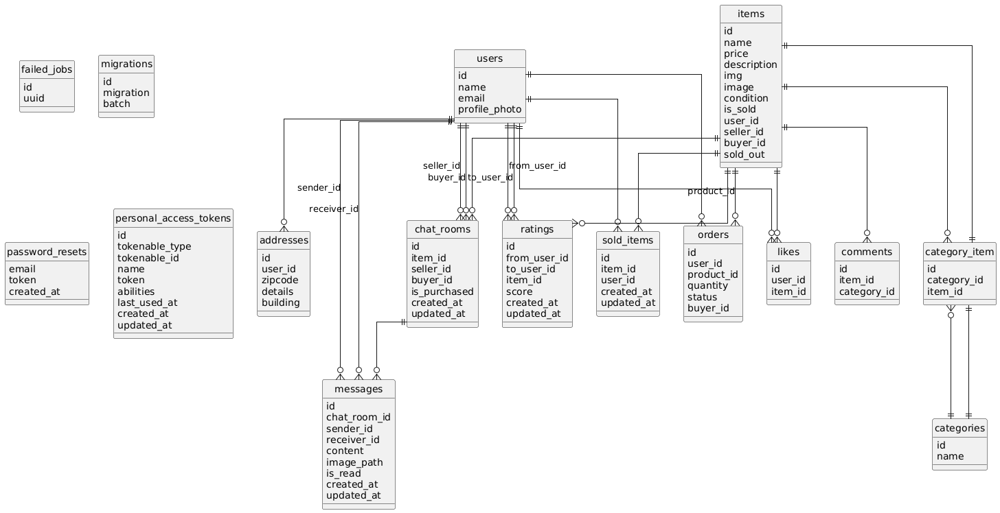

# FREE_MARKET アプリケーション

## 環境構築手順

### 1. Dockerビルド

```bash
git clone git@github.com:sakanamax0/free_market.git
cd free_market
docker-compose up -d --build
```

### 2. Laravel環境構築

```bash
docker-compose exec php bash
composer install
cp .env.example .env
# .envファイルの環境変数を適宜変更してください
php artisan key:generate
php artisan migrate --seed
php artisan storage:link
```

---

## 3. 開発環境アクセス

- トップページ  
  http://localhost/

- ユーザー登録ページ  
  http://localhost/register

- phpMyAdmin  
  http://localhost:8080/

---

## 一般ユーザーログイン情報（seed済み）

```text
| 種別           | メールアドレス       | パスワード |
|----------------|----------------------|------------|
| 一般ユーザー①  | test1@gmail.com       | password   |
| 一般ユーザー②  | test2@gmail.com       | password   |
| 一般ユーザー③  | test3@gmail.com       | password   |
```

---

## 使用技術・実行環境

```text
| 技術     | バージョン   |
|----------|--------------|
| PHP      | 7.4.9        |
| Laravel  | 8.83.8       |
| jQuery   | 3.7.1.min.js |
| MySQL    | 8.0.26       |
| nginx    | 1.21.1       |
```

---

## ER図



---

## 再クローンによる検証推奨

このリポジトリを GitHub に push した後、  
**一度別の場所に clone して、以下の手順でマイグレーションまで正常に進むか確認してください。**

```bash
git clone git@github.com:sakanamax0/free_market.git
cd free_market
docker-compose up -d --build
docker-compose exec php bash
composer install
cp .env.example .env
# 必要に応じて STRIPE_KEY などを設定
php artisan key:generate
php artisan migrate --seed
php artisan storage:link
```

---
